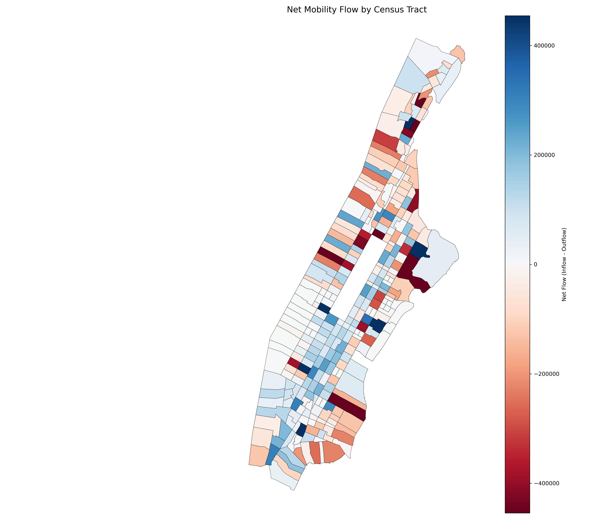

# SafeGraph Mobility Workshop
## February 6th, 2026

We will be using Binder to walk through the tutorial. Click the button above to launch your cloud-based image with all of the packages you need pre-installed.

</img>

 

</img>

 

</img>

 

## Licensing
See the [LICENSE](LICENSE) file for licensing information as it pertains to files in this repository.

## Contact
Ekin Uğurel (ekin.ugurel [at] nyu.edu)
